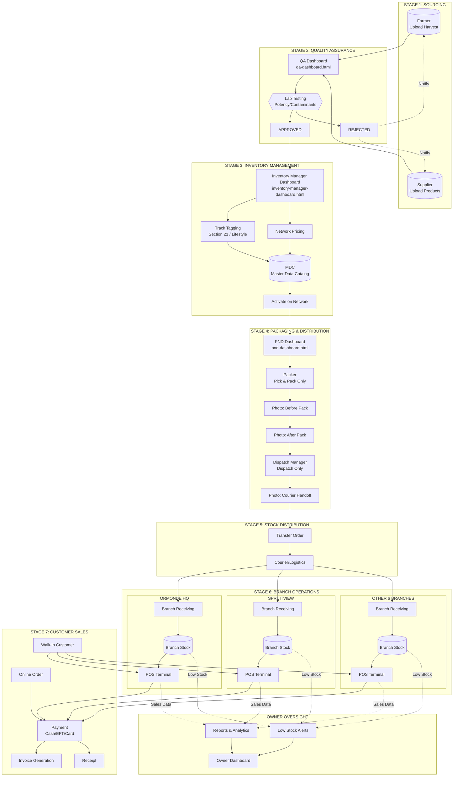
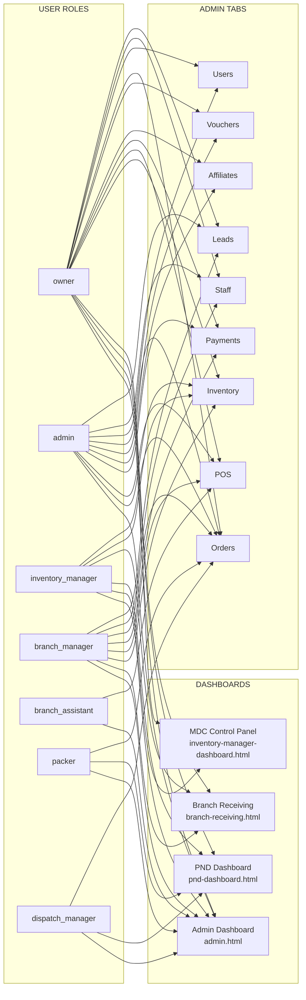
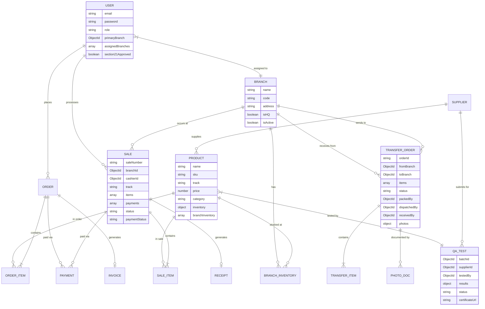
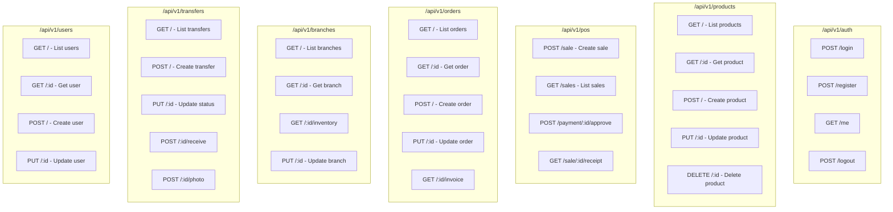

# De Bud Chef - Complete System Architecture

## System Flow Diagram



## Role Access Matrix



## Data Models



## API Endpoints Structure



## Dashboard Status

| Dashboard | File | Status | Roles | API Connected |
|-----------|------|--------|-------|---------------|
| Admin Panel | admin.html | COMPLETE | All staff | YES |
| MDC Control | inventory-manager-dashboard.html | UI DONE | owner, inventory_manager | NEEDS API |
| PND | pnd-dashboard.html | UI DONE | owner, inventory_manager, packer, dispatch_manager | NEEDS API |
| Branch Receiving | branch-receiving.html | UI DONE | owner, inventory_manager, branch_manager | NEEDS API |
| Owner Dashboard | owner-dashboard.html | NOT BUILT | owner | - |
| Supplier Portal | supplier-portal.html | NOT BUILT | supplier, farmer | - |
| QA Dashboard | qa-dashboard.html | NOT BUILT | qa_officer | - |

## ZayaHealth vs DBC Comparison

### What ZayaHealth Has (That DBC Needs)

| ZayaHealth Dashboard | DBC Equivalent | Status | Priority |
|---------------------|----------------|--------|----------|
| Farm Management | supplier-portal.html | NOT BUILT | Phase 2 |
| QA Compliance | qa-dashboard.html | NOT BUILT | Phase 2 |
| GMP Partner | PND Dashboard | ADAPTED | Done |
| MDC Inventory Manager | inventory-manager-dashboard.html | COPIED | Done |
| Delivery Logistics | (not planned) | - | Phase 3 |
| Financial/CFO | owner-dashboard.html | NOT BUILT | Phase 2 |
| Pharmacist | (not applicable - DBC is retail) | - | - |
| Doctor Assistant | (not applicable) | - | - |
| Patient B2C Store | index.html (public store) | EXISTS | Done |
| Store B2B Wholesale | (not applicable - DBC owns stores) | - | - |
| Admin Dashboard | admin.html | EXISTS | Done |

### Key Features to Adopt from ZayaHealth

1. **Zero Hardcoded Data** - All data from API/database
2. **Collapsible Sidebar Navigation** - Done in admin.html
3. **Real-time WebSocket Updates** - NOT YET in DBC
4. **5-Bubble Chat System** - For delivery communication - NOT YET
5. **6-Gate Onboarding** - For supplier verification - Phase 2
6. **CFO Wallet Approval** - Payment approval workflow - PARTIAL (EFT approval exists)

---

## PWA Apps Required (Photo Proof Roles)

```mermaid
flowchart TB
    subgraph PWA_APPS["PWA APPS NEEDED"]
        subgraph PACKER_PWA["PACKER PWA"]
            P1["Receive picking list"]
            P2["Photo: BEFORE packing"]
            P3["Pick products from shelf"]
            P4["Pack securely"]
            P5["Photo: AFTER packing"]
            P6["Label package"]
            P7["Mark complete"]
        end

        subgraph DISPATCH_PWA["DISPATCH MANAGER PWA"]
            D1["Verify package contents"]
            D2["Assign courier/driver"]
            D3["Photo: COURIER HANDOFF"]
            D4["Record courier details"]
            D5["Mark dispatched"]
        end

        subgraph RECEIVER_PWA["BRANCH RECEIVER PWA"]
            R1["Notification: shipment incoming"]
            R2["Photo: PACKAGE RECEIVED"]
            R3["Count verification"]
            R4["Report discrepancies"]
            R5["Accept into branch stock"]
        end

        subgraph DRIVER_PWA["DELIVERY DRIVER PWA"]
            DR1["Pickup confirmation"]
            DR2["GPS tracking"]
            DR3["Photo: DELIVERY PROOF"]
            DR4["Customer signature"]
            DR5["Complete delivery"]
        end
    end

    P1 --> P2 --> P3 --> P4 --> P5 --> P6 --> P7
    P7 --> D1
    D1 --> D2 --> D3 --> D4 --> D5
    D5 --> DR1
    DR1 --> DR2 --> DR3 --> DR4 --> DR5
    DR5 --> R1
    R1 --> R2 --> R3 --> R4 --> R5
```



### Photo Documentation Points (Fraud Prevention)

| Stage | Role | Photo Required | Purpose |
|-------|------|---------------|---------|
| 1. Before Packing | packer | YES | Verify products before pack |
| 2. After Packing | packer | YES | Verify sealed package |
| 3. Courier Handoff | dispatch_manager | YES | Chain of custody to courier |
| 4. Delivery Proof | driver | YES | Proof of delivery to branch |
| 5. Package Received | branch_manager | YES | Branch confirms receipt |

### PWA Technical Requirements

```
Each PWA App Must Have:
├── Offline capability (service worker)
├── Camera access for photos
├── GPS location (for driver app)
├── Push notifications
├── Session persistence
├── Role-locked functionality
└── Real-time sync when online
```

---

## Missing API Endpoints (To Build)

### Transfer Orders API
```
POST   /api/v1/transfers              - Create transfer order
GET    /api/v1/transfers              - List transfer orders (filter by status, branch)
GET    /api/v1/transfers/:id          - Get transfer order details
PUT    /api/v1/transfers/:id          - Update transfer order
POST   /api/v1/transfers/:id/pack     - Mark as packed (packer)
POST   /api/v1/transfers/:id/dispatch - Mark as dispatched (dispatch_manager)
POST   /api/v1/transfers/:id/receive  - Mark as received (branch_manager)
POST   /api/v1/transfers/:id/photo    - Upload photo documentation
```

### QA Testing API
```
POST   /api/v1/qa/batches             - Submit batch for testing
GET    /api/v1/qa/batches             - List batches (filter by status)
GET    /api/v1/qa/batches/:id         - Get batch details
PUT    /api/v1/qa/batches/:id         - Update test results
POST   /api/v1/qa/batches/:id/approve - Approve batch
POST   /api/v1/qa/batches/:id/reject  - Reject batch
```

### Stock Thresholds API
```
GET    /api/v1/thresholds             - List all thresholds
POST   /api/v1/thresholds             - Set threshold for product/branch
PUT    /api/v1/thresholds/:id         - Update threshold
GET    /api/v1/thresholds/alerts      - Get low stock alerts
```

---

## POS System Comparison (vs Industry Leaders)

### DBC Current State: ~65% Complete

| Feature | Lightspeed | Flowhub | Dutchie | **DBC** |
|---------|------------|---------|---------|---------|
| Basic POS | YES | YES | YES | **YES** |
| Multi-location | YES | YES | YES | **YES** |
| Section 21 Compliance | NO | YES | YES | **YES** |
| Batch/Lot Tracking | YES | YES | YES | **NO** |
| Purchase Limits | NO | YES | YES | **NO** |
| Supplier Management | YES | YES | YES | **NO** |
| Purchase Orders | YES | YES | YES | **NO** |
| Expiry Tracking | YES | YES | YES | **NO** |
| Split Payments | YES | YES | YES | **NO** |
| Staff Time Clock | YES | NO | NO | **NO** |
| Email Marketing | YES | YES | YES | **NO** |
| SMS Marketing | YES | YES | YES | **NO** |
| Real-time Dashboard | YES | YES | YES | **Partial** |

### Critical Missing Features (By Priority)

**PRIORITY 1 - Cannabis Compliance:**
1. Batch/lot tracking with cannabinoid profiles
2. Purchase limits enforcement per patient
3. Destruction tracking for expired product
4. Transfer manifest generation
5. SAHPRA compliance reporting

**PRIORITY 2 - Supply Chain:**
1. Supplier model and management
2. Purchase order workflow
3. Goods Received Notes (GRN)
4. Cost price history
5. Supplier performance tracking

**PRIORITY 3 - Advanced Inventory:**
1. Expiration date tracking
2. Full movement history (not just last 10)
3. Waste/shrinkage categorization
4. Stock take sessions with blind counts

**PRIORITY 4 - Customer Engagement:**
1. Email marketing integration
2. SMS marketing campaigns
3. Push notifications
4. Customer feedback/reviews

## Ormonde Launch Checklist (31 Jan 2026)

### Ready for Launch
- [x] POS Sales (Cash, EFT)
- [x] User Authentication
- [x] Role-based Access Control
- [x] Branch Assignment (staff to their branches)
- [x] Product Inventory
- [x] Invoice Generation
- [x] Receipt Generation

### UI Complete, Needs API
- [ ] Branch Receiving (connects to /api/v1/transfers)
- [ ] MDC Control Panel (connects to /api/v1/products bulk operations)
- [ ] PND Dashboard (connects to /api/v1/transfers)

### Phase 2 (After Launch)
- [ ] Supplier Portal
- [ ] QA Dashboard
- [ ] Owner Analytics Dashboard
- [ ] Auto-reorder System
- [ ] Inter-branch Transfers
